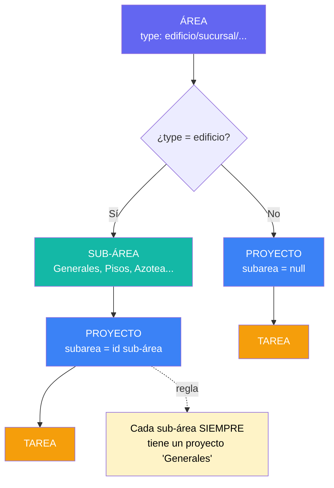

# Mapa de la app: Área → Sub-área → Proyecto → Tarea

Este documento explica cómo se organiza la información en Tropical Tower Operations,
desde el nivel más general (Área) hasta el más específico (Tarea).

## Diagrama gráfico



## Diagrama general (texto)

```
ÁREA
 │  type: sucursal | outlet | edificio | bodega | general | otros
 │
 ├── Si type = "edificio" ───────────────────────────────────────┐
 │                                                                │
 │   SUB-ÁREA  (solo existen para áreas tipo edificio)           │
 │   type: general | comercial | tecnico | otros                 │
 │     │                                                          │
 │     └── PROYECTO (subarea = id de la sub-área)                 │
 │           │   • Cada sub-área tiene siempre un proyecto         │
 │           │     llamado "Generales" para tareas sin             │
 │           │     proyecto específico.                            │
 │           │                                                      │
 │           └── TAREA (project = id del proyecto)                 │
 │                                                                │
 └── Si type ≠ "edificio" ───────────────────────────────────────┤
                                                                   │
     PROYECTO (subarea = null)                                    │
       │   • Los proyectos cuelgan directo del área.              │
       │                                                           │
       └── TAREA (project = id del proyecto)                      │
                                                                   ┘
```

## Niveles y campos clave

### 1. Área (`Area`, `src/types/index.ts`)
| Campo | Descripción |
|---|---|
| `id`, `name`, `slug` | Identificación |
| `type` | `sucursal`, `outlet`, `edificio`, `bodega`, `general`, `otros` — define si tiene sub-áreas |
| `color`, `icon` | Estilo visual en sidebar y tarjetas |
| `description` | Texto opcional |

Solo las áreas con `type = 'edificio'` tienen sub-áreas. El resto van directo a Proyectos.

### 2. Sub-área (`SubArea`, `src/types/index.ts`) — solo en Edificio
| Campo | Descripción |
|---|---|
| `id`, `name`, `slug` | Identificación |
| `area` | FK → `Area.id` (debe ser un área tipo edificio) |
| `type` | `general`, `comercial`, `tecnico`, `otros` |
| `color`, `icon`, `description` | Estilo y descripción |

Ejemplo: el área "Edificio Corporativo" (`corp`) tiene sub-áreas como "Generales",
"Pisos", "Azotea", etc.

### 3. Proyecto (`Project`, `src/types/index.ts`)
| Campo | Descripción |
|---|---|
| `id`, `name` | Identificación |
| `area` | FK → `Area.id` |
| `subarea` | FK → `SubArea.id`, o `null` si el área no es edificio |
| `due`, `progress`, `count` | Fecha límite, % de avance, cantidad de tareas |

**Regla "Generales":** toda sub-área de un área tipo edificio tiene un proyecto
`name = "Generales"` con `subarea` apuntando a esa sub-área. Sirve como destino por
defecto para tareas que no pertenecen a ningún proyecto específico de esa sub-área.
El formulario de "Nueva tarea" (`NewTaskModal.tsx`, `getGeneralesProject()`) lo
preselecciona automáticamente al elegir Área → Sub-área.

### 4. Tarea (`Task`, `src/types/index.ts`)
| Campo | Descripción |
|---|---|
| `id`, `code`, `title` | Identificación |
| `project` | FK → `Project.id` |
| `area` | FK → `Area.id` (denormalizado para queries rápidas) |
| `assignee`, `helper` | Responsable y colaborador |
| `status`, `priority`, `progress` | Estado, prioridad, % de avance |
| `due`, `start_date`, `end_date` | Fechas (Gantt) |
| `subtasks`, `comments`, `tags`, `phase` | Detalle adicional |

## Ejemplo concreto: Edificio Corporativo (`corp`)

```
Edificio Corporativo (area, type=edificio)
 ├── Sub-área "Generales"   → Proyecto "Generales" (subarea=sub-corp-generales)
 ├── Sub-área "Pisos 1-5"   → Proyecto "Generales" (subarea=sub-corp-pisos-1-5)
 │                              + otros proyectos específicos de esa sub-área
 └── Sub-área "Azotea"      → Proyecto "Generales" (subarea=sub-corp-azotea)
                                + otros proyectos específicos
```

## Ejemplo concreto: Sucursal (no-edificio)

```
Sucursal "Equipetrol" (area, type=sucursal)
 ├── Proyecto "Apertura tienda"  (subarea=null)
 ├── Proyecto "Remodelación Q3"  (subarea=null)
 └── Proyecto "Generales"        (subarea=null) — opcional, no obligatorio
```

## Archivos clave del código

| Archivo | Rol |
|---|---|
| `src/types/index.ts` | Definiciones TypeScript de Area, SubArea, Project, Task |
| `src/lib/db.ts` | Queries y mutaciones a Supabase (fetch/create de cada entidad) |
| `src/stores/app.ts` | Store Zustand: estado global, selectores de visibilidad por permisos |
| `src/components/layout/Sidebar.tsx` | Renderiza la jerarquía Área → Sub-área → Proyecto en la navegación |
| `src/pages/AreaView.tsx` | Vista de un área: proyectos directos (no-edificio) o sub-áreas (edificio) |
| `src/components/modals/NewSubAreaModal.tsx` | Crear/editar sub-áreas (solo edificio) — crea su proyecto "Generales" automáticamente |
| `src/components/modals/NewProjectModal.tsx` | Crear proyectos, con selección de sub-área si el área es edificio |
| `src/components/modals/NewTaskModal.tsx` | Crear tareas; resuelve automáticamente el proyecto "Generales" según área/sub-área elegida |

## Migraciones relevantes (`supabase/migrations/`)

- `20260521_010_subareas.sql` — crea la tabla `subareas` y la columna `projects.subarea`
- `20260521_011_subareas_edificio_only.sql` — restringe sub-áreas solo a áreas tipo edificio
- `20260611_015_generales_per_subarea.sql` — crea el proyecto "Generales" para cada sub-área de edificio que no lo tenga
